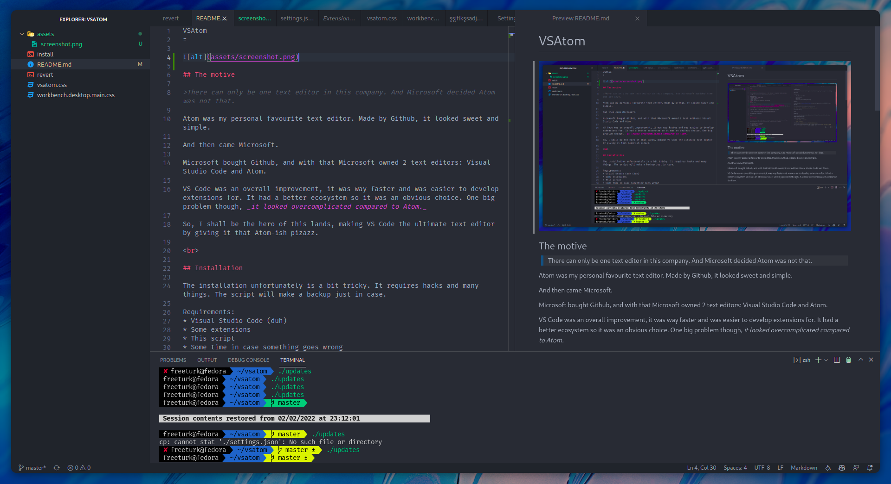

VSAtom
=



## The motive

>There can only be one text editor in this company. And Microsoft decided Atom was not that.

Atom was my personal favourite text editor. Made by Github, it looked sweet and simple.

And then came Microsoft.

Microsoft bought Github, and with that Microsoft owned 2 text editors: Visual Studio Code and Atom.

VS Code was an overall improvement, it was way faster and was easier to develop extensions for. It had a better ecosystem so it was an obvious choice. One big problem though, _it looked overcomplicated compared to Atom._

So, I shall be the hero of this lands, making VS Code the ultimate text editor by giving it that Atom-ish pizazz.

<br>

## Installation

The installation unfortunately is a bit tricky. It requires hacks and many things. The script will make a backup just in case.

Requirements:
* Visual Studio Code (duh)
* Some extensions
* This script
* Some time in case something goes wrong
<br>

To start, you should install the [Custom CSS and JS Loader](https://marketplace.visualstudio.com/items?itemName=be5invis.vscode-custom-css) extension. Set it up according to its README, then come back here.

Also, go to your Visual Studio Code extensions, and install two things:
* `One Dark Theme`
* `Material Icons`

Then you should clone this repository to anywhere you want

```git clone https://github.com/FreeTurk/vsatom.git```

and enter the directory.

Then;

### For Linux:

For now, the script only supports Fedora, because that is what I use. If you write a script for other Linux distros, please create an issue.

Run the following commands:
* `sudo chmod +x install`
* `sudo ./install`

This will create a `vsatom.css` file in `~/.local/share/styles`.

Then go ahead and open VS Code. Press <kbd>CTRL</kbd> + <kbd>Shift</kbd> + <kbd>P</kbd> and search for `Open Settings (JSON)`. This will open a JSON file for the settings. In that JSON file, add this entry:

```JSON    
"vscode_custom_css.imports": [
        "file:///home/(username)/.local/share/styles/vsatom.css"
    ], 
```
Replace `(username)` with your username.

Then, restart VS Code. After this _we are not done yet_.

Go to the settings page (the GUI version this time) by pressing <kbd>CTRL</kbd> + <kbd>,</kbd>.

From there, disable the following settings:
* `Breadcrumbs: Enabled`
* `Editor › Minimap: Enabled`
* `Workbench › Activity Bar: Visible

And... Done!

Good luck, and create an issue for any bugs you find.

## Uninstall

Run the following commands:
* `sudo chmod +x restore`
* `sudo ./restore`

This will revert the hacks we use. To revert the rest, enable the settings we previously disabled and also disable the `Custom CSS and JS Loader` extension.

### For Windows and macOS:

There is no install script currently. Please make one and inform me!